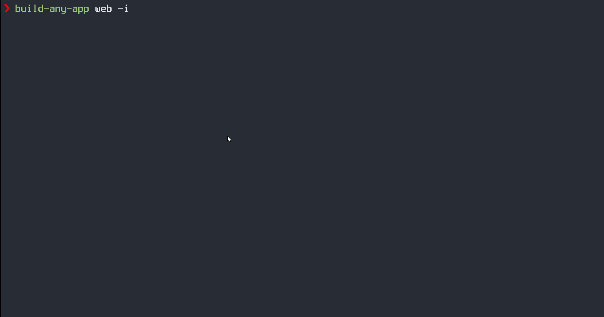

# Build Any App
<!-- ALL-CONTRIBUTORS-BADGE:START - Do not remove or modify this section -->
[![All Contributors][all-contrib-badge]](#contributors-)
<!-- ALL-CONTRIBUTORS-BADGE:END -->

[![Commitizen friendly][commitizen-badge]][commitizen]
[![Build][build-badge]][build]
[![semantic-release: conventionalcommits][semantic-release-badge]][semantic-release]
![ts][ts-badge]
[![Contributor Covenant][coc-badge]][coc]
[![PRs Welcome][prs-badge]][make-pr]
[![License][license-badge]][license]
[![downloads][downloads-badge]][npmcharts]
[![version][version-badge]][package]

Generate template of your apps dynamically. 

Build-any-app can run in interactive mode with the option -i through which it prompts for an option if it's not provided.
Non-interactive mode can be used in scripts. Also, you can run the app in debug mode with --debug switch.

# Prompts

Following common options can be provided for your application
    
    --name/-n:                  Author Name
    --repo-name/-r              Repository Name
    --description/-d            Project Description
    --package-name/-p           Package name
    --private-pkg               Is your project private
    --private-repo              Is your repo private
    --publish                   Do you wish to publish your project
    --provider                  Git provider. Choices - github, gitlab
    --license/-l                License
    --static-tools/-t           The static tools you want to use. Multiple Choices - typescript, eslint, prettier, jest, commitizen, huksy, None
    --code-quality-tools/-c     The code quality tools you want to use. Multiple Choices - codecov, code-climate, None
    --cicd                      The CI/CD tool you want to use. Choices - github-actions, circleci, None
    --token                     Git provider token
    --npm-token                 NPM token (if you want to publish your package)
    --debug                     Run build-any-app in debug mode
    --interactive/-i            Run build-any-app in interactive mode

Following options can be provided for a web application
    
    --framework/-f              The framework you want to use for your web application. Choices - react
    --ui/-u                     The UI library you want to use for your web application. Choices - react-bootstrap
    --stateLibrary/-s           The global state management library you want to use for your web application. Choices - redux, zustand

# Example

build-any-app web

build-any-app web -i -n "John Smith" -r my-app

build-any-app web -n "John Smith" -r my-app --private --publish -i

build-any-app web -f react --cicd github-actions -n "John Doe" -r my-app -u react-bootstrap -s zustand -t typescript eslint jest prettier commitizen husky --privatePkg false

build-any-app web -i -d "Build any app project" -p my-package-name --cicd github-actions --private-package false --private-repo false --publish true --provider github --token <github_token> --npm-token <npm-token> -t eslint prettier typescript jest commitizen husky -c code-climate codecov --license mpl-2.0 -f react -u react-bootstrap -s redux -r my-app2

# Details

Following options are only used if a git provider is provided

--token, --license, --private-repo, --cicd

Following options are only used if a git provider is provided and a CI/CD tool is provided

--publish, --code-quality-tools

Following options are only used if a git provider is provided, a CI/CD tool is provided and if you choose to publish the package

--name, --description, --package-name, --private-pkg, --npm-token

# Contributors ✨

Thanks goes to these wonderful people ([emoji key](https://allcontributors.org/docs/en/emoji-key)):

<!-- ALL-CONTRIBUTORS-LIST:START - Do not remove or modify this section -->
<!-- prettier-ignore-start -->
<!-- markdownlint-disable -->
<table>
  <tbody>
    <tr>
      <td align="center" valign="top" width="14.28%"><a href="https://github.com/basantech89"> <b>Basant Soni</b></a> <a href="https://github.com/basantech89/create-app/issues?q=author%3Abasantech89" title="Bug reports">🐛</a> <a href="#blog-basantech89" title="Blogposts">📝</a> <a href="https://github.com/basantech89/create-app/commits?author=basantech89" title="Code">💻</a> <a href="#data-basantech89" title="Data">🔣</a> <a href="https://github.com/basantech89/create-app/commits?author=basantech89" title="Documentation">📖</a> <a href="#design-basantech89" title="Design">🎨</a> <a href="#example-basantech89" title="Examples">💡</a> <a href="#ideas-basantech89" title="Ideas, Planning, & Feedback">🤔</a> <a href="#infra-basantech89" title="Infrastructure (Hosting, Build-Tools, etc)">🚇</a> <a href="https://github.com/basantech89/create-app/pulls?q=is%3Apr+reviewed-by%3Abasantech89" title="Reviewed Pull Requests">👀</a> <a href="https://github.com/basantech89/create-app/commits?author=basantech89" title="Tests">⚠️</a></td>
    </tr>
  </tbody>
  <tfoot>
    <tr>
      <td align="center" size="13px" colspan="7">
        
          <a href="https://all-contributors.js.org/docs/en/bot/usage">Add your contributions</a>
        </img>
      </td>
    </tr>
  </tfoot>
</table>

<!-- markdownlint-restore -->
<!-- prettier-ignore-end -->

<!-- ALL-CONTRIBUTORS-LIST:END -->

This project follows the [all-contributors](https://github.com/all-contributors/all-contributors) specification. Contributions of any kind welcome!

# LICENSE

Apache License 2.0

[package]: https://www.npmjs.com/package/build-any-app
[version-badge]: https://img.shields.io/npm/v/build-any-app.svg?style=flat-square
[downloads-badge]: https://img.shields.io/npm/dm/build-any-app.svg?style=flat-square
[npmcharts]: http://npmcharts.com/compare/build-any-app
[license-badge]: https://img.shields.io/badge/License-Apache_2.0-blue.svg
[license]: https://github.com/basantech89/build-any-app/blob/master/LICENSE
[prs-badge]: https://img.shields.io/badge/PRs-welcome-brightgreen.svg?style=flat-square
[make-pr]: https://makeapullrequest.com
[coc-badge]: https://img.shields.io/badge/Contributor%20Covenant-2.1-4baaaa.svg
[coc]: https://github.com/basantech89/build-any-app/blob/master/CODE_OF_CONDUCT.md
[ts-badge]: https://badgen.net/badge/-/TypeScript/blue?icon=typescript&label
[semantic-release-badge]: https://img.shields.io/badge/semantic--release-conventionalcommits-ff69b4?logo=semantic-release
[semantic-release]: https://github.com/semantic-release/semantic-release
[build-badge]: https://github.com/basantech89/create-app/actions/workflows/build.yml/badge.svg
[build]: https://github.com/basantech89/create-app/actions/workflows/build.yml
[commitizen-badge]: https://img.shields.io/badge/commitizen-friendly-brightgreen.svg
[commitizen]: http://commitizen.github.io/cz-cli/
[all-contrib-badge]: https://img.shields.io/badge/all_contributors-1-orange.svg?style=flat-square